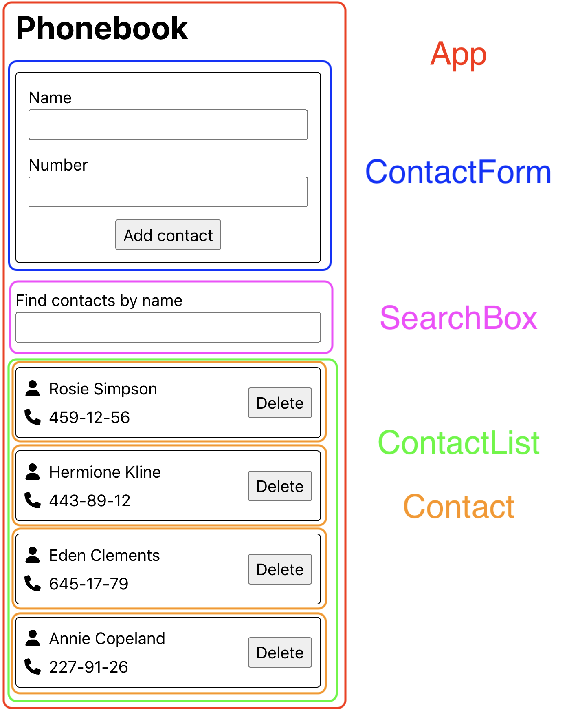
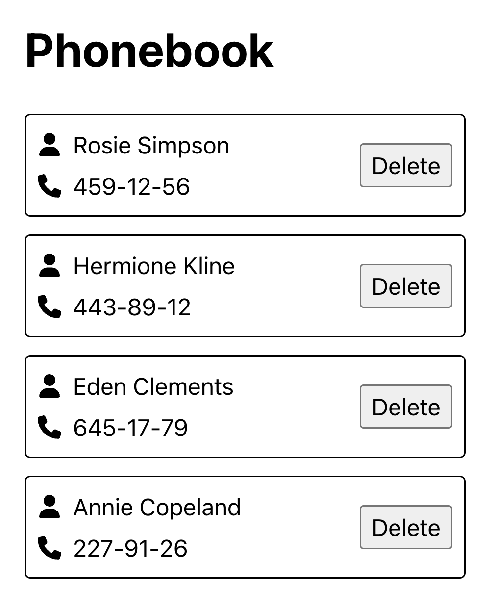

# Tier 4. Module 1: Mastering Front-End Development with React

## Topic 5 - Forms
## Topic 6 - Formik library

## Homework

### Technical task - Phonebook

Write an application for storing phone book contacts. The application should consist of a form, a contact list, and a search field to filter the contact list.

#### Components

In this task, the interface is already divided into components. Your task is to think about the state and props and transfer it to the code. Parts of the interface included in the component are marked with a frame of the corresponding color.



The following components should be highlighted: the root component, the contact add form, the contact list, the contact list element, and the search filter.

#### Step 1. List of contacts

The state of the `App` component must contain an array of contacts. During development, it will be convenient to hardcode some data into the state. This will avoid the need to manually enter data in the interface to test new functionality. For example, use this pin array for the initial state value.

```
[
  {id: 'id-1', name: 'Rosie Simpson', number: '459-12-56'},
  {id: 'id-2', name: 'Hermione Kline', number: '443-89-12'},
  {id: 'id-3', name: 'Eden Clements', number: '645-17-79'},
  {id: 'id-4', name: 'Annie Copeland', number: '227-91-26'},
]
```

Create `ContactList` and `Contact` components and use them to display a list of contacts. Pass the required values ​​through props.

After this step, the application interface will look like this - page title and contact list.



#### Step 2. Search by name

Add a `SearchBox` that can be used to filter the list of contacts by name.

* A search field is a formless input whose value is written to a state (controlled element).
* The filtering logic must be case insensitive.

After this step, when you type text in the search field, the contact list should refresh to display only matching contacts.

#### Step 3. Adding contacts

At this stage, implement adding a contact to the list of contacts through the `ContactForm` form. Each contact must be an object with the properties `name`, `number` and `id`, that is, the same as in the test data that you currently have in your state.

The form must be created using the [Formik](https://formik.org/) library. Add validation of form fields by the [Yup](https://github.com/jquense/yup) library and output error messages:

* fields must be filled out;
* the minimum number of characters is 3;
* the maximum number of characters is 50.

After completing this step, the app should look something like this.

#### Step 4. Deleting Contacts

Expand the functionality of the application, allowing the user to delete previously saved contacts by clicking the `Delete` button in the contact card.

#### Step 5. Saving contacts

The application must store the array of contacts between page refreshes in local storage. Use effects.

* When you add or remove a contact, the contacts are saved to local storage.
* When the application loads, the contacts, if any, are read from the local storage and written to the state.

### Acceptance criteria

* Main link: the assignment work page on [Vercel](https://vercel.com/).
* The project was created using [Vite](https://vitejs.dev/).
* The [Formik](https://formik.org/) library is used to create forms.
* When visiting the live task page, there are no errors or warnings in the console.
* For each component, there is a separate folder in the `src/components` folder that contains the JSX file of the React component itself and its styles file. The name of the folder, the component file (with the extension `.jsx`) and the style file (before `.module.css`) are the same and correspond to the names specified in the tasks (if there were any)
* The JS code is clean and clear, using **Prettier**.
* Styling is done by **CSS modules**.
